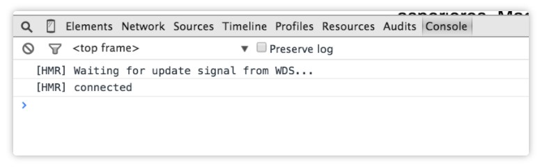

# webpack-test

# Hot Module Replacement（HMR）

HMR的作用[知乎-饿了么前端](https://zhuanlan.zhihu.com/p/30669007)

1. 对模块进行热替换，不会刷新整个页面，从而保存页面的应用状态
如： 页面中有弹窗，如果没有热替换，页面刷新之后应用状态丢失，此时弹窗消失
2. 自动化打包并热替换更改的模块，省去手动操作
3. HMR 兼容市面上大多前端框架或库，比如 React Hot Loader，Vue-loader，能够监听 React 或者 Vue 组件的变化，实时将最新的组件更新到浏览器端


## Webpack Dev Server 

### live reloading

Use webpack with a development server that provides live reloading. This should be used for development only

`webpack-dev-server` 提供了一个简单的 web 服务器，并且能够实时重新加载(live reloading)

```
  "scripts": {
    "start": "webpack-dev-server"
  },
```
 
默认服务器地址是`localhost:8080`，此时更改模块，整个页面都会刷新，还没有达到热替换（HMR）的效果

### Webpack Dev Server 热模块替换

#### 简单配置

```
// webpack.config.js

devServer: {
  contentBase: './dist',
  hot: true
}

plugins: [
  new webpack.HotWebpackReplacementPlugin()
]

```

```
// 入口文件
import printMe from './print';

// code ...

if (module.hot) {
  module.hot.accept('./print.js', function() {
    console.log('Accepting the updated printMe module!');
    printMe(); // print.js中的方法
  })
}

```

此时更改`print.js`模块，会启动HMR，<font color="red">但是更改入口文件`index.js`会导致live reloading</font>

> Note that `webpack.HotModuleReplacementPlugin` is required to fully enable HMR. If webpack or webpack-dev-server are launched with the `--hot` option, this plugin will be added automatically, so you may not need to add this to your webpack.config.js
例如CLI启动命令`webpack-dev-server --hot`

<font color="red"></font>
<font color="red">疑问： `print.js`中对外到处方法必须要加`default`???</font>,如果不加的话就实现不了HMR，更改模块会整体刷新页面

```
export default function printMe() {
   console.log('Updating prin0')
}
```

#### 配合Node API

和上面的区别就是
1. 去掉`webpack.config.js`中的`devServer`配置
2. 新增文件配置`webpack-dev-server`
3. CLI启动新增文件

```
// server.js新增文件

const webpackDevServer = require('webpack-dev-server');
const webpack = require('webpack');

const config = require('./webpack.config.js');
const options = {
  contentBase: './dist',
  hot: true,
  host: 'localhost'
};

webpackDevServer.addDevServerEntrypoints(config, options);
const compiler = webpack(config);
const server = new webpackDevServer(compiler, options);

server.listen(5000, 'localhost', () => {
  console.log('dev server listening on port 5000');
});

```

上面的webpackDevServer.addDevServerEntrypoints(config, options);还可以像下面这样配置

```
  entry: [
    'webpack-dev-server/client?http://0.0.0.0:3000', // WebpackDevServer host and port
    'webpack/hot/only-dev-server', // "only" prevents reload on syntax errors
    './scripts/index' // Your appʼs entry point
  ]
```

>`webpack/hot/dev-server` will reload the entire page if the HMR update fails. If you want to [force a page reload when HMR update fail.](https://github.com/webpack/webpack/issues/418), you can add `webpack/hot/only-dev-server` to the entry point instead.


## webpack-dev-middleware

伺服器，通过连接服务器提供从webpack发出的文件

通过watch mode监听到文件变更，这个中间件不再提供旧包，而是延迟请求直到编译完成。在文件修改之后立刻刷新页面。
不消耗磁盘，在内存中运行

客户端渲染相关的案例见https://github.com/webpack/webpack-dev-middleware

### live reloading

配合第三方服务器express

```
// webpack.config.js

output: {
      filename: '[name].bundle.js',
      path: '/',
+     publicPath: '/'
}

```

> `publicPath` 也会在服务器脚本用到，以确保文件资源能够在 http://localhost:3000 下正确访问

```
const express = require('express');
const webpack = require('webpack');
const webpackDevMiddleware = require('webpack-dev-middleware');

const app = express();
const config = require('./webpack.config.js');
const compiler = webpack(config);

// Tell express to use the webpack-dev-middleware and use the webpack.config.js
// configuration file as a base.
app.use(webpackDevMiddleware(compiler, {
  publicPath: config.output.publicPath
}));

// Serve the files on port 3000.
app.listen(3000, function () {
  console.log('Example app listening on port 3000!\n');
});

```

### webpack-hot-middleware HMR

> Webpack hot reloading using only `webpack-dev-middleware`. This allows you to add hot reloading into an existing server without `webpack-dev-server`.


> The webpack-dev-server is a little node.js Express server, which uses the webpack-dev-middleware to serve a webpack bundle.

#### 配置entry

```
// webpack.config.js
entry:    [
    'webpack/hot/dev-server'
    'webpack-hot-middleware/client'
    "#{__dirname}/../client/index.coffee"
]

output: { 
    path: '/'
    publicPath: 'http://localhost:3000/scripts/'
    filename: 'bundle.js'
}

plugins: [
    new webpack.HotModuleReplacementPlugin(),
    new webpack.NoEmitOnErrorsPlugin()
]
```

- webpack/hot/dev-server

```
'webpack/hot/only-dev-server',
    // 为热替换（HMR）打包好运行代码
    // only- 意味着只有成功更新运行代码才会执行热替换（HMR）
```

- path
使输出路径为“/”，因为请记住，您现在正在将应用程序构建到内存中，而不是构建文件夹。

- webpack-hot-middleware/client

> This connects to the server to receive notifications when the bundle rebuilds and then updates your client bundle accordingly. 
bundle重建并更新client bundle时连接server并接收通知

`'webpack-hot-middleware/client?reload=true'`,
reload=true的意思是，如果碰到不能hot reload的情况，就整页刷新。

- publicPath
publicPath作用是模板、样式、脚本、图片等资源对应的server上的路径
应用场景：
在开发环境配合webpack-dev-middleware使用时，因为是将打包文件存储在内存中，也就是配置在本地服务器路径。
在生产环境中，因为静态资源可能配置在CND服务器中，所以会配置对应服务器路径。


#### 配置server.js文件

```
express = require 'express'
webpack = require 'webpack'
config = require './config/webpack.dev.config'
webpackDevMiddleware = require 'webpack-dev-middleware'
webpackHotMiddleware = require 'webpack-hot-middleware'

app = express()
router = express.Router()

router.get('/', someController)
app.use(router)

compiler = webpack(config)

app.use(webpackDevMiddleware(compiler, {
    publicPath: config.output.publicPath,
    stats: {colors: true}
}))

app.use(webpackHotMiddleware(compiler, {
    log: console.log
}))

app.listen(3000,  -> console.log 'listening on 3000')

```

- publicPath (required)
The path where to bind the middleware to the server.
In most cases this equals the webpack configuration option output.publicPath.

- stats
输出统计数据的选项Output options for the stats.
`options.colors` With console colors
具体相关配置可参考[官方文档](http://webpack.github.io/docs/node.js-api.html)

- 其他options
```
webpackDevMiddleware(compiler, {
    // 这里的公共路径是前端包最终导出的地址
   options
})
```
里面的options详细配置表参照[官方文档](http://webpack.github.io/docs/webpack-dev-middleware.html)


现在我们只需要在index.html中引入bundle.js就结束了。

我使用nodemon来监视我的后端文件，所以我可以进行更改并重新启动节点进程，但请记住排除客户端文件，以便webpack-dev-middleware可以照管它们。

在加载应用程序时，应该看到webpack-hot-middleware试图连接到控制台中的dev服务器



# BUG

## CLI刷新但客户端不刷新

描述：
通过`webpack-dev-middleware`和`webpack-hot-middleware`搭配`express`服务器进行HMR时，每次更改模块，CLI都会刷新（命令行一直在走），但是浏览器没反应
code
```
app.use(WebpackDevMiddleware(webpack(config),{
    publicPath: config.output.publicPath
}))

app.use(WebpackHotMiddleware(webpack(config),{
    path: '/__webpack_hmr',
}));
```

解决

```
const compiler = webpack(config);

app.use(WebpackDevMiddleware(compiler,{
    publicPath: config.output.publicPath
}))

app.use(WebpackHotMiddleware(compiler,{
    path: '/__webpack_hmr',
}));

```

归纳：
就是需要将webpack(config)的编译结果存储起来，否则webpack-hot-middleware里面加载的编译文件始终是原来的编译文件，所以导致虽然webpack-dev-middleware编译文件，但是客户端没响应

>     
You are including webpackMiddleware twice, and you're not using a shared compiler but creating a new one for each middleware. Please read the documentation carefully.[来自stackoverflow](https://stackoverflow.com/questions/44753823/webpack-hot-middleware-not-working-with-webpack-dev-middleware)

## npm run server failed

场景
从github下载文件安装包之后将整个项目拷贝到另一个文件中，然后在另一个文件中运行，会报下面的错误。

原因
拷贝过后项目里面的包的引用路径出错，所以导致启动项目失败

解决
将项目中的`node_modules`包文件删除,然后重新下载包，就解决了，一定要先删除再下载，不然直接下载包文件是没用的

参考https://stackoverflow.com/questions/44365238/how-can-i-resolve-npm-err-code-elifecycle-in-project-js-during-npm-start
```
// log
17 verbose argv "D:\\software\\node.js\\node.exe" "D:\\software\\node.js\\node_modules\\npm\\bin\\npm-cli.js" "run" "server"
18 verbose node v8.9.0
19 verbose npm  v5.5.1
20 error code ELIFECYCLE
21 error errno 1
22 error webpack-test@1.0.0 server: `babel-node server.js`
22 error Exit status 1
23 error Failed at the webpack-test@1.0.0 server script.
23 error This is probably not a problem with npm. There is likely additional logging output above.
24 verbose exit [ 1, true ]

```
```
PS D:\everydaywork\test\mianshi\webpack-test> npm run server

> webpack-test@1.0.0 server D:\everydaywork\test\mianshi\webpack-test
> babel-node server.js

module.js:538
    throw err;
    ^

Error: Cannot find module 'v8flags'
    at Function.Module._resolveFilename (module.js:536:15)
    at Function.Module._load (module.js:466:25)
    at Module.require (module.js:579:17)
    at require (internal/module.js:11:18)
    at Object.<anonymous> (D:\everydaywork\test\mianshi\webpack-test\node_modules\_babel-cli@6.26.0@babel-cli\lib\babel-node.js:3:18)
    at Module._compile (module.js:635:30)
    at Object.Module._extensions..js (module.js:646:10)
    at Module.load (module.js:554:32)
    at tryModuleLoad (module.js:497:12)
    at Function.Module._load (module.js:489:3)
npm ERR! code ELIFECYCLE
npm ERR! errno 1
npm ERR! webpack-test@1.0.0 server: `babel-node server.js`
npm ERR! Exit status 1
npm ERR!
npm ERR! Failed at the webpack-test@1.0.0 server script.
npm ERR! This is probably not a problem with npm. There is likely additional logging output above.
```